   
   
   
   
   
  

---

### About me

I am **Aarushi Krishna**, a **software developer** who loves turning messy problems into clean, reliable products. I currently ship features at a **fast-moving startup**, and I also run my **own proprietorship**—a tech practice where we **build, innovate, and deliver** full-stack solutions for clients who need everything from MVPs to production systems.

- **Education:** B.Tech in **Computer Science & Engineering** from **Dr. A.P.J. Abdul Kalam Technical University** (**AKTU**), Lucknow, Uttar Pradesh—formerly known as **Uttar Pradesh Technical University (UPTU)**.
- **What I enjoy:** product-minded engineering, crisp UX, scalable APIs, and shipping with intention.
- **Outside code:** collaborating on ideas, learning new stacks, and refining how software feels in the real world.

---

### Tech stack

  

<b>Stack notes (hover-friendly)</b>

| Layer        | Tools |
|-------------|-------|
| **Frontend** | HTML, CSS, JavaScript, TypeScript, React, Next.js |
| **Backend**  | Node.js, Express.js, Java |
| **Data**     | MongoDB |
| **Languages**| Python, C |

---

### GitHub pulse

  
  

  

---

### Currently

- Building and iterating in a **startup** environment (high ownership, fast feedback loops).
- Growing my **proprietorship**: consulting, custom builds, and end-to-end delivery across the stack.
- Always open to **meaningful collaborations**, open source, and hackathons.

---

**Thanks for visiting my profile.**

<!--
Optional: “Snake” contribution animation (popular on GitHub profiles)
1) Add workflow from: https://github.com/Platane/snk
2) Then embed: 
-->
